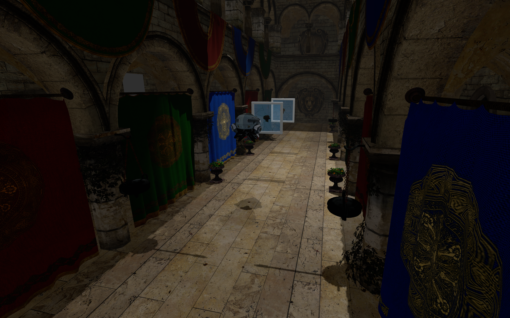

# Vulkan Renderer

A modern 3D rendering engine built with Vulkan.



## Features

### Implemented
- [x] Base Vulkan rendering pipeline
- [x] Model loading with Assimp
- [x] Skybox/Cubemap rendering
- [x] Basic material system
- [x] Multiple light types (Directional, Point, Spot)
- [x] Basic shadow mapping
- [x] Camera controls

### Roadmap

#### Shadows
- [ ] Add shadow atals for multiple light sources
- [ ] Add soft shadows (PCSS, VSM)
- [ ] Add tetrahedron shadow maps for point lights
- [ ] Add cascaded shadow maps for directional light
- [ ] Add skylight
- [ ] Add SSAO

#### Post-Effects
- [ ] Add Bloom
- [ ] Add HDR
- [ ] Add ACES Tone Mapping
- [ ] Add EV100 Auto Exposure
- [ ] Add FXAA

#### Lighting
- [ ] Implement PBR lightning using Disney BRDF

### Particles
- [ ] Implement basic particle system

#### Optimizations
- [ ] Add frustum culling
- [ ] Add meshoptimizer
- [ ] Add runtime shader compilation

#### UI
- [ ] Add basic UI
- [ ] Add gizmos

## Dependencies

- [Vulkan SDK](https://vulkan.lunarg.com/) (1.3+)
- [SDL3](https://github.com/libsdl-org/SDL) (3.2.10+)
- [GLM](https://github.com/g-truc/glm) (1.0.1+)
- [Assimp](https://github.com/assimp/assimp) (5.4.3+)
- [vcpkg](https://github.com/microsoft/vcpkg) (for dependency management)
- CMake (3.10+)
- C++17 compatible compiler

## Build Instructions

### Setup vcpkg

```bash
# Clone vcpkg if you don't have it already
git clone https://github.com/Microsoft/vcpkg.git
cd vcpkg
# Build vcpkg
./bootstrap-vcpkg.sh  # On Linux/macOS
# or
bootstrap-vcpkg.bat   # On Windows

# Set environment variable for CMake to find vcpkg
export VCPKG_ROOT=/path/to/your/vcpkg  # On Linux/macOS
# or
set VCPKG_ROOT=C:\path\to\your\vcpkg   # On Windows
```

### Building the Project

```bash
# Clone the repository
git clone https://github.com/yourusername/vulkan-renderer.git
cd vulkan-renderer

# Create build directory
mkdir build && cd build

# Configure with CMake
cmake ..

# Build
cmake --build .
```

### Compiling Shaders

The project includes scripts to compile GLSL shaders to SPIR-V:

```bash
# On Linux/macOS
./compile-shaders.sh

# On Windows
compile-shader.bat
```

**Note:** After compiling shaders or updating any assets, simply run `cmake ..` from your build directory. 

After building, run the executable from the build directory:

```bash
# On Linux/macOS
./VulkanRenderer

# On Windows
VulkanRenderer.exe
```

## Controls

- WASD - Move camera
- Mouse - Look around
- Escape - Exit application

## License

[MIT License](LICENSE) 